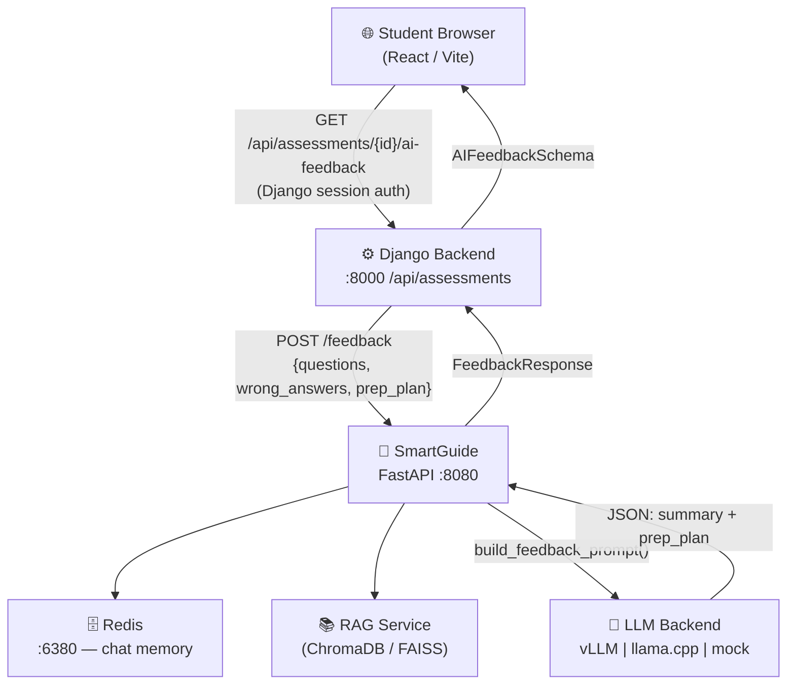

# SmartGuide — LLM Microservice

AI-powered placement coaching microservice for the **SkillFull / EduCollab** platform.  
Runs on GPU using [vLLM](https://github.com/vllm-project/vllm) or llama.cpp, exposed as a FastAPI service on port **8080**.

---

## Architecture



### Data Flow — Assessment Analysis

```
Student completes MCQ
        │
        ▼
Django /assessments/{id}/ai-feedback
  ┌─────────────────────────────────────────────────┐
  │  Fetches every AssessmentQuestion from DB:       │
  │  • question.text, options, correct_answer        │
  │  • assessmentquestion.user_answer, is_correct    │
  │  • question.subject.name, question.difficulty    │
  │  Classifies into weak_topics / strong_topics     │
  └─────────────────────────────────────────────────┘
        │
        ▼  POST /feedback (full Q&A payload)
SmartGuide
  ┌─────────────────────────────────────────────────┐
  │  build_feedback_prompt()                         │
  │  → Injects wrong Q&A pairs into LLM prompt      │
  │  → RAG retrieves domain knowledge chunks         │
  │  LLM returns JSON:                               │
  │   • overall_summary                              │
  │   • strengths / improvement_areas                │
  │   • priority_topics                              │
  │   • suggested_resources                          │
  │   • motivational_note                            │
  │   • prep_plan[]:                                 │
  │       { topic, hours_needed, priority,           │
  │         what_to_study, resources }               │
  └─────────────────────────────────────────────────┘
        │
        ▼
Frontend modal displays:
  📋 Overall Summary
  ✅ Strengths  /  ⚠️ Areas to Improve
  📖 Priority Topics (numbered)
  ⭐ Suggested Resources (clickable links)
  ⏱️ Personalised Study Plan (hours per topic)
  🎉 Motivational Note
```

---

## Endpoints

| Endpoint | Method | Description |
|:--|:--|:--|
| `/feedback` | POST | Deep analysis of assessment — returns summary, strengths, weak areas, priority topics, prep plan with hours |
| `/schedule` | POST | Day-by-day study schedule up to a target interview date |
| `/chat` | POST/SSE | Streaming mock-interview coach (Server-Sent Events) |
| `/ingest` | POST | Ingest study material chunks into the RAG knowledge base |
| `/health` | GET | Service health check |

---

## Quick Start (Development — mock LLM, no GPU needed)

```bash
cd smartguide

# 1. Install deps
python -m venv venv && source venv/bin/activate
pip install -r requirements.txt

# 2. Configure
cp .env.example .env
# Leave LLM_BACKEND=mock for testing without a GPU

# 3. Start Redis (needed for chat memory)
docker run -d -p 6380:6379 redis:7-alpine

# 4. Run the service
REDIS_URL=redis://localhost:6380/1 uvicorn app.main:app --reload --port 8080
```

API docs: http://localhost:8080/docs

---

## GPU Deployment (vLLM)

### Requirements
- NVIDIA GPU with ≥ 12 GB VRAM (RTX 3080 / 4080 / A100 etc.)
- NVIDIA drivers ≥ 525
- [nvidia-container-toolkit](https://docs.nvidia.com/datacenter/cloud-native/container-toolkit/)

### Steps

```bash
# 1. Download model weights (first time only)
pip install huggingface-hub
huggingface-cli download mistralai/Mistral-7B-Instruct-v0.3 \
    --local-dir ./models/Mistral-7B-Instruct-v0.3

# 2. Update .env
#   LLM_BACKEND=vllm
#   MODEL_NAME=./models/Mistral-7B-Instruct-v0.3

# 3. Build & run
docker compose up --build
```

## Low-VRAM Option (llama.cpp / GGUF)

```bash
# Download 4-bit quantised GGUF (~4 GB)
huggingface-cli download TheBloke/Mistral-7B-Instruct-v0.2-GGUF \
    mistral-7b-instruct-v0.2.Q4_K_M.gguf \
    --local-dir ./models

# Update .env
#   LLM_BACKEND=llama_cpp
#   GGUF_MODEL_PATH=./models/mistral-7b-instruct-v0.2.Q4_K_M.gguf
```

---

## Project Structure

```
smartguide/
├── app/
│   ├── main.py              # FastAPI entry point + CORS
│   ├── config.py            # Pydantic-settings config
│   ├── routers/
│   │   ├── feedback.py      # POST /feedback  ← assessment analysis
│   │   ├── schedule.py      # POST /schedule  ← study planner
│   │   ├── chat.py          # POST /chat      ← mock interview (SSE)
│   │   └── ingest.py        # POST /ingest    ← RAG knowledge base
│   ├── services/
│   │   ├── llm_service.py   # vLLM / llama.cpp / mock backends
│   │   ├── prompt_builder.py# Structured prompt templates + RAG injection
│   │   ├── rag_service.py   # ChromaDB/FAISS retrieval
│   │   └── memory.py        # Redis conversation memory
│   └── schemas/
│       ├── feedback.py      # AssessmentInput, FeedbackResponse, PrepTopic
│       └── schedule.py      # ScheduleRequest, StudyPlan
├── models/                  # (gitignored) Model weights
├── Dockerfile               # CUDA 12.1 image
├── docker-compose.yml       # SmartGuide + Redis
└── .env.example             # Environment variable reference
```

---

## Integration with SkillFull

```
Browser (React)
  └──▶ Django :8000 /api/assessments/{id}/ai-feedback   (JWT/session auth)
          └──▶ SmartGuide :8080 /feedback                (internal only)
                  ├──▶ LLM Backend (vLLM / llama.cpp / mock)
                  ├──▶ Redis (chat history)
                  └──▶ RAG (study material chunks)
```

The Django proxy enriches the request with full Q&A data from the database before forwarding to SmartGuide, so the LLM analyses **actual wrong answers** rather than just topic names.
